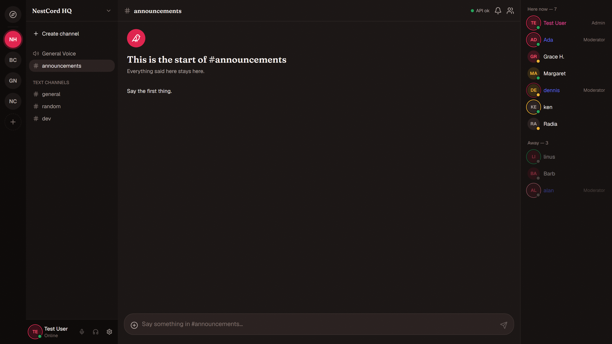

# NestCord

A Discord clone: servers and channels, roles and permissions with channel overrides, direct
messages, friends, attachments, notifications, WebRTC voice channels, and realtime messaging,
typing and presence throughout.



- **Scope** — one API process, one PostgreSQL database, local file storage, a few hundred users.
  Fixed before the first line was written, and defended since: [PLAN.MD](./PLAN.MD) is as much a
  list of what this deliberately does not do as what it does.
- **Constraints** — [CLAUDE.md](./CLAUDE.md) and `.claude/rules/` are the standing rules for the
  codebase: the layering (controller, service, Prisma, nothing in between), the immutability and
  file-size conventions, the security invariants, the named technologies that stay out.
- **Review** — every change was read against those rules before it landed, and the work that
  missed them was sent back rather than patched over. Every pull request in this repository was
  reviewed by hand and merged by me, not rubber-stamped. The rules exist because that is how you
  get a consistent codebase out of a tool that will happily give you five different architectures.

## Dependencies

You need:

- Node.js 20.19+, 22.12+ or 24+ (even-numbered releases only — Prisma)
- pnpm 11+ (`npm install -g pnpm`)
- Docker (runs PostgreSQL)

Built with:

- **Backend** — NestJS, Prisma, PostgreSQL, Socket.IO, JWT, Argon2
- **Frontend** — React, Vite, TanStack Router + Query, Zustand, Tailwind, Radix
- **Tooling** — pnpm workspaces, TypeScript, ESLint, Prettier, Vitest, Playwright

## Setup

```bash
git clone https://github.com/Elliot200504/NestCord.git
cd NestCord
pnpm install

cp .env.example .env
openssl rand -base64 48    # run twice, paste into JWT_ACCESS_SECRET and JWT_REFRESH_SECRET

docker compose up -d       # PostgreSQL on localhost:5432
pnpm db:migrate
pnpm db:seed               # optional — one development account to log in with

pnpm dev
```

- Web — http://localhost:5173
- API — http://localhost:3000/api
- Swagger — http://localhost:3000/api/docs

Skip `pnpm db:seed` if you would rather register your own account at the sign-up page instead.

If any of that does not go to plan, [SETUP.md](./SETUP.md) walks the same ground one step at a time,
from a clean machine, and has a troubleshooting section.

Seeded login: `test@nestcord.local` / `password123`

That one account is all the seed creates, and it never deletes anything — the servers, channels and
messages you make while developing stay put, and re-running it on an existing account reports it and
changes nothing. Everything else is yours to create in the app.

## Authentication

Register at http://localhost:5173/register, or log in with the seeded account above.

- Passwords are hashed with Argon2id. `POST /api/auth/register|login|refresh|logout` and
  `GET /api/auth/me` are the whole surface.
- A short-lived access token comes back in the response body and is kept in memory by the web app —
  never in `localStorage`.
- The long-lived refresh token is an httpOnly cookie scoped to `/api/auth`, stored hashed in the
  `Session` table and rotated on every refresh. Logging out deletes the session row, so the access
  token stops working immediately.
- Every API route requires a valid token unless it is explicitly marked `@Public()`.

All environment variables live in one `.env` at the repo root; `.env.example` lists them all. The API
validates them at boot and refuses to start if any are missing.

## Errors

Users are never shown a technical error. A global exception filter turns everything a route throws
into one shape: a 4xx keeps the sentence the route wrote for the user, and anything unexpected — a
crash, an unhandled Prisma error — becomes a generic apology plus a short reference code such as
`ERR-9F3A2C`. The real message and stack go to the `ErrorLog` table and the server log, never to the
client.

Admins read those at **Settings → Error log**, newest first, and can look one up by the reference a
user quoted. Who counts as an admin is `ADMIN_EMAILS` in `.env`, a comma-separated list of email
addresses — empty means nobody, so the route is closed until it is configured:

```bash
ADMIN_EMAILS="test@nestcord.local"    # the seeded account, to see the page in development
```

The check runs on the server against the database on every request, so the frontend flag only decides
whether the link is listed.

## Commands

| Command               | Purpose                      |
| --------------------- | ---------------------------- |
| `pnpm dev`            | Run the API and web app      |
| `pnpm build`          | Build everything             |
| `pnpm lint`           | ESLint                       |
| `pnpm typecheck`      | `tsc --noEmit` everywhere    |
| `pnpm format`         | Prettier write               |
| `pnpm test`           | Vitest                       |
| `pnpm db:generate`    | Regenerate the Prisma client |
| `pnpm db:migrate`     | Create and apply a migration |
| `pnpm db:seed`        | Reseed development data      |
| `pnpm db:reset`       | Drop, re-migrate and reseed  |
| `pnpm db:studio`      | Prisma Studio                |
| `pnpm packages:build` | Rebuild shared and database  |

Target one package: `pnpm --filter @nestcord/api <script>`.

### End-to-end tests

`pnpm test` is Vitest only. The Playwright journeys drive the real stack, so they run
separately and need PostgreSQL up and the database seeded:

```bash
pnpm --filter @nestcord/web exec playwright install --with-deps chromium   # once
pnpm db:seed
pnpm --filter @nestcord/web test:e2e        # add :ui for the Playwright inspector
```

They start `pnpm dev` themselves, or reuse it if it is already running. All they need in the
database is the seeded account: a `setup` project runs first and builds what the journeys
expect — a server named "Playwright" with two channels, and two friend rows — over the API.
It only creates what is missing, so later runs reuse the same world, and it leaves the
servers and channels you made yourself alone.

## Layout

```text
apps/api/          NestJS API
apps/web/          React + Vite
packages/database/ Prisma schema, migrations, seed
packages/shared/   types, constants, permission flags
```

## How it was built

I did not write most of this code. I decided what it would be, and held it to that.

> **Read before running this anywhere real.** Most of the code here was written by AI tools under my
> direction and review. It is a learning project: nothing in it has been audited or
> penetration-tested, and the security-sensitive parts — authentication, authorization, file uploads
> — are written to be sensible, not proven. Take it apart, learn from it, borrow from it. Do not put
> it in front of real users and expect it to hold.

## License

[MIT](./LICENSE)
